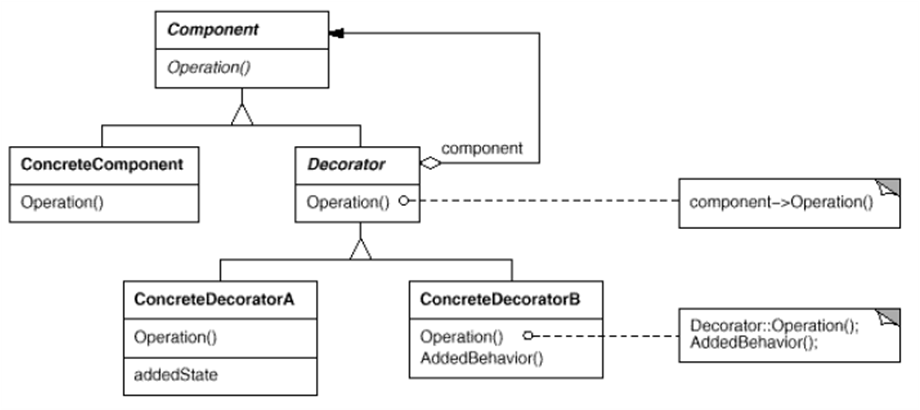

# Stream

# IO(InputOutput) Stream
* Decorator Pattern으로 구현되어 있음

## IO Stream 구분
* IO 대상 기준 : Input Stream, Output Stream
* 자료의 종류 : Byte 단위 Stream, 문자 단위 Stream
* Stream 기능 : 기반 Stream, 보조 Stream

## Stream 종류
1. Byte 단위 Stream
    * **InputStream**
    * **OutputStream**

2. 문자 단위 Stream
    * **Reader**
    * **Writer**

## 표준 입출력
* System 클래스의 표준 입출력 멤버
```java
public class System{
    public static PrintStream out;
    public static InputStream in;
    public static PrintStream err;
}
```

## Byte 단위 Stream
* Byte 단위로 자료를 읽고 씀(동영상, 음악파일 등)
* Function(Input)
    * **int read()** : 입력 스트림으로부터 1byte 읽고 Byte 리턴, 읽을게 없다면 -1 Return
    * **int read(byte[] b)** : 읽은 Byte들을 배열 b에 저장하고, 실제로 읽은 Byte 수를 리턴
* Function(Output)
    * **void write(int b)** : b의 끝 1byte를 출력 버퍼에 보낸다.
    * **void wirte(byre[] b)** : 배열 b의 모든 Byte를 보낸다.
    * **void flush()** : 출력 버퍼를 비운다.
### File Stream
* **FileInputStream** : File이 없는 경우 예외 발생
* **FileOutputStream** : File이 없는 경우 파일 생성하여 출력
   
```java
public class InputOutputStream {
    public static void main(String[] args) {

        System.out.println("입력 ");
        try {
            int i;
            InputStreamReader isr = new InputStreamReader(System.in);
            while((i = isr.read()) != '끝') {
                System.out.print((char) i);
            }
        } catch (IOException e) {
            e.printStackTrace();
        }
    }
} 
```    

## 문자 기반 Stream
* 2 Byte씩 처리해야 함

### File Stream
* **FileReader**
* **FileWriter**
```java
public class ReaderWriterStream {
    public static void main(String[] args) throws IOException {
        FileReader fis = new FileReader("src/reader.txt");
//        FileInputStream fis = new FileInputStream("src/reader.txt");
//        InputStreamReader isr = new InputStreamReader(fis);
        int i;
        while((i = fis.read())!= -1){
            System.out.println((char)i);
        }
        fis.close();
    }
}
```

## 보조 Stream
* 실제로 읽고 쓰는 Stream이 아닌 보조적인 기능을 추가하는 Stream
* FilterInputStream과 FileOutputStream이 보조 Stream의 상위 클래스
    * **pretected FilterInputStream(InputStream in)**
    * **public FilterOutputStream(OutputStream out)**

### 종류
* **InputStreamReader(InputStream is)** : Byte를 문자 기반으로 읽어들인다.
* **Buffered Stream** : 내부에 8192byte 배열을 가지고 있어, 읽거나 쓸 때 속도가 빠름.
    * **BufferedInputStream(InputStream is)**
    * **BufferedOutputStream(OutputStream os)**
    * **String readLine()** : Line Feed('\n')와 Carriage Return('\r')을 제거해주고 한 줄을 읽어 들인다.
    
* Data Stream : 자료가 저장된 상태 그대로 자료형을 유지하며 읽기, 쓰기 기능을 제공하는 Stream
    * **DataInputStream**
    * **DataOutputStream**

```java
public class SubStream{
    public static void main(String[] args){
        try(FileOutputStream fos = new FileOutputStream("data.txt");
                DataOutputStream dos = new DataOutputStream(fos);
                FileInputStream fis = new FileInputStream("data.txt");
                DataInputStream dis = new DataInputStream(fis)){

            dos.writeByte(100);
            dos.write(100);
            dos.writeChar('A');
            dos.writeUTF("안녕하세요");

            System.out.println(dis.readByte());
            System.out.println(dis.read());
            System.out.println(dis.readChar());
            System.out.println(dis.readUTF);

        }catch(Exception e){
            e.printStackTrace();            
        }
    }
}
```

## 직렬화(Serialization)
* 인스턴스의 상태를 그대로 저장하거나 Network로 전송하고 
이를 다시 복원(Deserialization) 하는 방식
* 보조 Stream
* Object Stream 사용
    * **ObjectInputStream**
    * **ObjectOutputStream**
    * **readObject, writeObject**
* 직렬화를 위해서는 해당 클래스에 **Serializable Interface**를 사용하여 명시해야 된다.
```java
class Person implements Serializable{   // 구현 코드가 없는 mark interface
    String name;
    transient String job;   // transient 키워드, 해당 코드는 직렬화하지 말라는 의미
}
```

* **External** Interface를 이용하여 읽기, 쓰기에 대해 정의할 수 있다. 
    * **writeExternal, readExternal** 함수 Override
    
## Others
### File Class
* 파일 개념을 추상화한 클래스
* Function
    * **boolean exist()** : 해당 파일이 존재하는지 여부
    * **boolean createNewFile()** : 새로운 File 생성
    * **boolean mkdir()** : 새로운 Directory 생성
    * **boolean mkdirs()** : 경로 상에 없는 모든 Directory 생성
    * **boolean delete()** : File or Directory 삭제
     
### RandomAccessFile Class
* 입출력 클래스 중 유일하게 파일 입출력을 동시에 할 수 있는 클래스
* 파일 포인터가 있어서 읽고 쓰는 위치의 이동이 가능함
* Function
    * **seek()** : 해당 위치로 이동
    
### Decorator Pattern

*Fastcampus_박은종*
* **Component** : 최상위 클래스
* **ConcreteComponent** : Component 자식 클래스, 기반 Class(Component)
* **Decorator** : Component 자식 클래스, 보조 Class(Component)
* **ConcreteDecoratorA, B** : Decorator 자식 클래스.
 Operation의 경우, Decorator 클래스의 Operation을 실행하고, 다른 기능을 추가한다.
```java
abstract class Component{
    abstract void operation();
}
class ConcreateComponent extends Component{
    void operation(){
        // 실행 코드
    }
}
class Decorator extends Component{
    Component component;
    public Decorator(Component component){
        this.component = component;
    }
    
    public void operation(){
        this.component.operation();
    }
}

class ConcreateDecoratorA extends Decorator{
    public ConcreateDecoratorA(Component component){
        super(component);
    }
    public void operation(){
        super.operation();
        // 추가 실행 코드
    }
}

```


### Reference
* Fastcampus 강의(박은종)