# Java Garbage Collection
* JVM에서 사용되는 Garbage Collection에 대한 내용을 요약한 것이다.
* 원본은 오라클 공식 사이트 내용이다
    * https://www.oracle.com/webfolder/technetwork/tutorials/obe/java/gc01/index.html

## Garbage Collector가 하는 일
#### Step 1. Marking
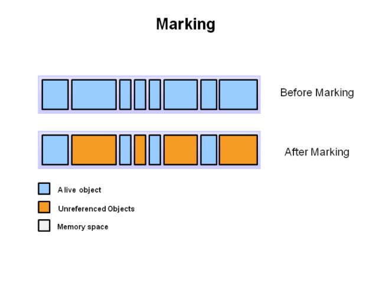
* Garbage Collector는 처음에 Marking이라는 작업을 하게 된다.
* Garbage Colector는 Marking을 위해서 메모리를 스캔하여 어떤 Object가 참조되어지고 있는지, 아닌지를 판단한다.
* 그 뒤에 참조되어지고 있지 않은 Object에 Marking을 한다.
* 모든 Object를 스캔하고 Marking을 해야할지 결정해야 되기 때문에 많은 시간이 소요될 수 있다.

#### Step 2. Normal Deletion
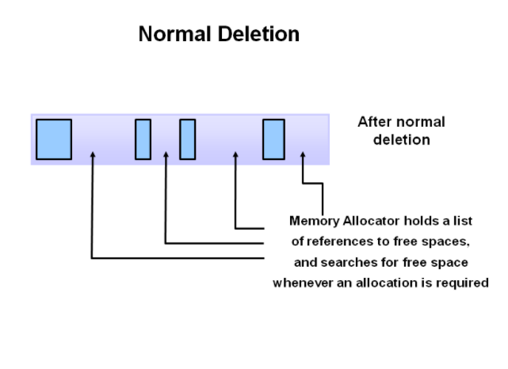
* Normal Deletion은 참조되어지지 않는 Object를 삭제한다.
* 삭제 후, Memory Allocator는 Free Space에 포인팅을 한다.

#### Step 3. Deletion with Compacting
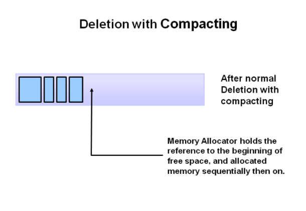
* Performace를 증가시키기 위해서 참조되어지지 않는 Object를 삭제 한 후, Compacting 과정을 진행한다.
* 참조되어지는 Object의 메모리를 한 쪽으로 이동시킨다
    * Memory Fragmentation으로 인한 성능 저하 때문인거 같다.

## Hotspot Heap Structure
* Hotspot Heap Structure에 대한 내용이다.

### Hotspot Heap Structure
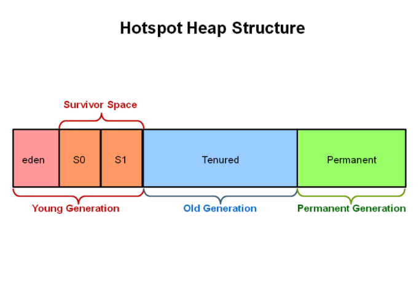
* 크게 Young Generation, Old Generation, Permanent Generation 으로 나뉜다.
* 자세히 나눈다면 eden, survivor0, survivor1, Tenured, Permanent 로 나뉜다. 

#### Young Generation
* 새로운 Object가 할당되면 해당 위치에 할당된다.
* Young Generation이 가득채워지면, Minor Garbage Collection이 발생한다.
* Minor Collection는 대부분의 객체는 금방 참조되어지지 않는(객체 사망률이 높다)다는 가정하에 최적화되어 진다.
* 몇몇의 계속 살아있는 Object는 Old Generation으로 이동하게 된다.

#### Stop the World Event
* 해당 이벤트는 모든 Application Thread들의 동작을 멈춘다.
* 모든 Minor Garbage Collection은 "Stop the World" 이벤트를 발생시킨다.

#### Old Generation
* Old Generation은 오랫동안 살아있는 Object들을 저장하기 위해 사용된다.
* Old Generation에서 발생하는 GC를 Major Garbage Collection이라 한다.

#### Permanent Generation
* 해당 영역에는 JVM에 클래스와 메소드들을 설명하기 위한 Metadata가 저장된다.
* 보통 Applcation에서 Runtime에 Application에서 사용하고 있는 클래스들이 저장된다.

## Garbage Collection Process
1. 처음에 새로운 객체가 할당되면, eden 공간에 만들어진다.
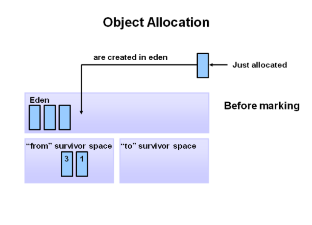
2. eden 공간이 가득차게 되면, Minor GC(Garbage Collection)이 발생한다.
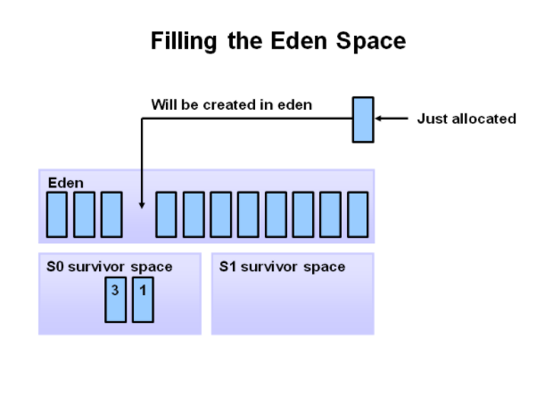
3. Referenced Object들은 survivor0 공간으로 복사되고, Unreferenced Object들은 
eden 공간이 비워지면서 삭제가 된다.
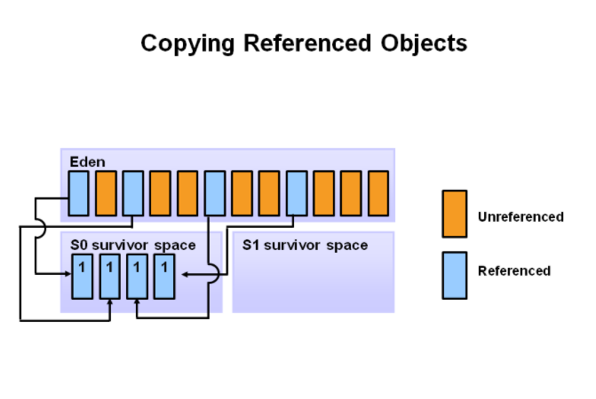
4. 다음 Minor GC에는 같은 일이 eden과 survivor0 공간에서 발생한다. Unreferenced Object들은 eden과 survivor0 공간이 비워지면서 삭제된다.
그리고 eden과 survivor0에 있는 Referenced Object들은 survivor1 공간으로 복사되며 survivor0에 있던 Object들은 age가 증가한다(age는 얼만큼 살아있는지 체크하기 위한 count라고 생각하면 될 거 같다.).
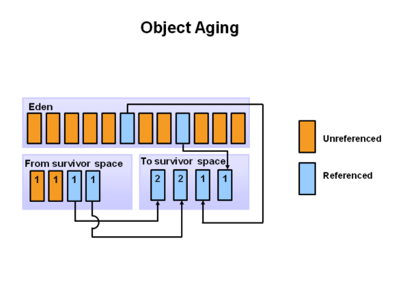
5. 또 다음 Minor GC가 발생하면 4번과 똑같이 동작된다. 단지 이번에는 eden과 survivor1에서 survivor0로 이동하게 된다. 이 과정이 계속 반복된다.
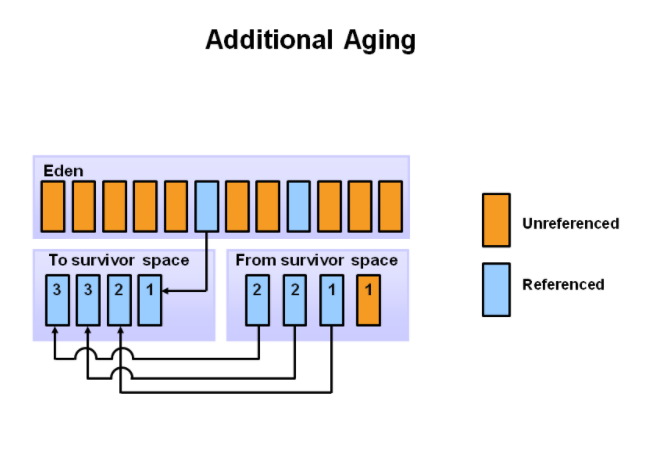
6. 이렇게 Minor GC가 발생하다보면, 오래된 Object는 age threshold에 도달하게 된다. 그리고 도달한 Object는 Old Generation으로 승격하게 된다.
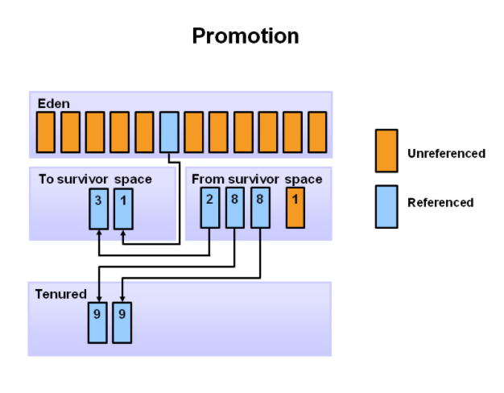
7. Minor GC로 승격은 계속해서 이뤄질 것이다.
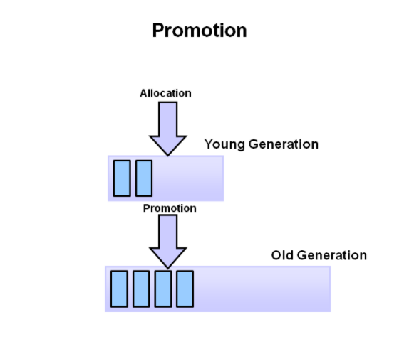
8. 이 과정이 계속 반복해서, Old Generation도 가득채워지면 Major GC가 발생한다.
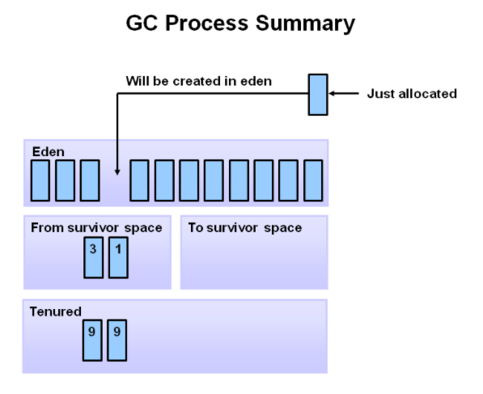

#### Reference
* https://d2.naver.com/helloworld/1329

